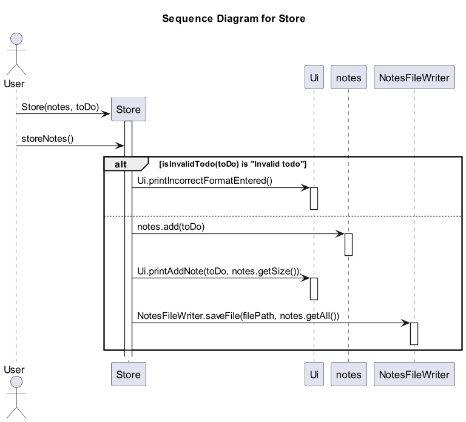
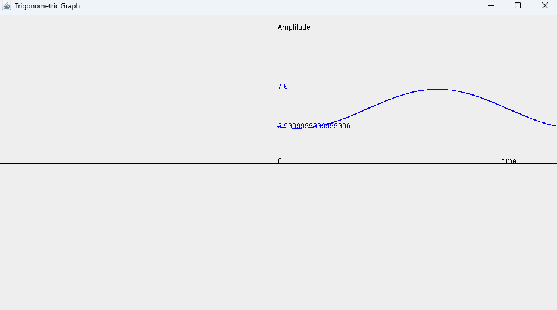
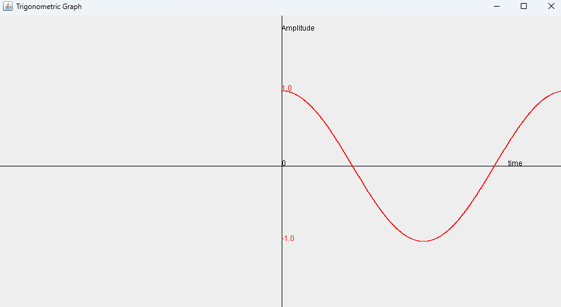

# GitHub User Guide for BadMaths ➕➖✖️➗

## Table of Contents:
<!-- TOC -->
* [GitHub User Guide for BadMaths ➕➖✖️➗](#github-user-guide-for-badmaths-)
  * [Table of Contents:](#table-of-contents-)
  * [Introduction 🧮](#introduction-)
  * [Quick Start](#quick-start)
  * [Features](#features)
    * [1) Graph Analyser and Visualiser: `Graph`](#1--graph-analyser-and-visualiser--graph)
    * [2) Matrix Calculation: `Matrix`](#2--matrix-calculation--matrix)
    * [3) Store Notes: `Store`](#3--store-notes--store)
    * [4) Display All Notes: `List`](#4--display-all-notes--list)
    * [5) Display A Specific Note: `List <index>`](#5--display-a-specific-note--list-index)
    * [6) Delete Notes: `Delete <index>`](#6--delete-notes--delete-index)
    * [7) Clear All Notes Stored In Notes List `Clear`](#7--clear-all-notes-stored-in-notes-list-clear)
    * [8) Mark Notes: `Mark`](#8--mark-notes--mark)
    * [9) Unmark Notes: `Unmark`](#9--unmark-notes--unmark)
    * [10) List All Items Marked As Completed: `FindMark`](#10--list-all-items-marked-as-completed--findmark)
    * [11) List All Notes That Are Not Marked As Completed: `FindUnmark`](#11--list-all-notes-that-are-not-marked-as-completed--findunmark)
    * [12) Find Notes Using Keyword: `FindInfo`](#12--find-notes-using-keyword--findinfo)
    * [13) Prioritize A Note](#13--prioritize-a-note)
    * [14) Display All Notes Based On All Priority Types:](#14--display-all-notes-based-on-all-priority-types-)
    * [15) Display All Notes Of A Certain Priority Type: `FindPrior`](#15--display-all-notes-of-a-certain-priority-type--findprior)
    * [16) Solving Quadratic Equations: `Quadratic`](#16--solving-quadratic-equations--quadratic)
    * [17) Help Manual `Help`](#17--help-manual-help)
    * [18) Exit BadMaths `Bye`](#18--exit-badmaths-bye)
  * [FAQ](#faq)
  * [Command Summary](#command-summary)
<!-- TOC -->

## Introduction 🧮

Hello! Welcome to BadMaths! BadMaths is a quick lookup tool for
trigonometry graphs and basic matrix operations that aims to help students save
time when performing Mathematical Operations.

To help you get started, our team has put together this user guide to guide you on
the steps to operate BadMaths for your Mathematical woes.

## Quick Start

Before you start using BadMaths, make sure you have the following ready!

1. Ensure that you have Java 11 or above installed.
2. Down the latest version of `BadMaths` from [here](https://github.com/AY2223S2-CS2113-F10-2/tp.git).

## Features

### 1) Graph Analyser and Visualiser: `Graph`
This feature accepts a trigonometry equation (Sinusoidal signal) and outputs the amplitude, frequency, phase, and vertical shift.
It also displays the image of the corresponding graph. 

Format: `Graph [Amplitude]*[Trigo]([Frequency]*x[sign][PhaseShift])[sign][VerticalShift]`

* `Amplitude` can be any positive number. E.g. `15.5`, `4`, `0`
* `Trigo` can be sin, cos or tan. 
* `Frequency` can be any positive integer (more than 0). E.g. `100`
  * When entering frequency, one can include 𝜋 by typing `2*pi*x` instead of `6.283*x`
* `PhaseShift`, `VerticalShift` can be any positive number. E.g. `15.1`, `4`, `0`,`1`
* `sign` can be + or - .
* `[` and `]` are not needed when entering the input.
* Some form of elimination is possible: 
  * When `Amplitude` is 1, `1*cos(1*x)` can be shortened to `cos(1*x)`
  * When `PhaseShift` or `verticalShift` is 0, `[sign][PhaseShift]` or `[sign][VerticalShift]` are not needed.

**Note: Accuracy of graph drawn is up to 4 digits (Thousand place) for numerical inputs. E.g. `9999`.**


Example input 1:
```
Graph 2985*sin(5999*x+2665)-8678
```
Example output 1:
```
This is the amplitude: 2985.0
This is the freq (Hz): 954.7705036082801
This is the phase: 2665.0
This is the vertical shift: -8678.0
```


Example input 2:
```
Graph 2*sin(5*pi*x-2)+5.6
```
Example output 2:
```
This is the amplitude: 2.0
This is the freq (Hz): 2.5
This is the phase: -2.0
This is the vertical shift: 5.6
```


Example input 3: 
```
Graph cos(5*x)
```
Example output 3:
```
This is the amplitude: 1.0
This is the freq (Hz): 0.7957747154594768
This is the phase: 0.0
This is the vertical shift: 0.0
```


### 2) Matrix Calculation: `Matrix`
This feature accepts matrix equation and outputs calculation result.

Format: `Matrix. [Matrix] [operator] [Matrix]`

* `[Matrix]` is the 2 dimensional matrix with integer elements. When you declare the matrix, you should follow the matrix format below:
  ```
  [1,2;3,4]
  ```
   * You should separate the elements with comma (,) in the single row.
   * You should separate the rows with the semicolons.

  ```
  [1,2;3,4].T
  ```
   * You can declare transposed matrix with the transpose annotation `.T`.
   * Transposed matrix above is equal with matrix `[1,3;2,4]`.

* `[operator]` is the matrix operator. You can use 4 operators below:
   * `.*` : matrix multiplication
   * `*` : element wise product
   * `+` : matrix addition
   * `-` : matrix subtraction

Example input:
 ```
 Matrix. [1,2;3,4] .* [4,5;6,7]
 ```
### 3) Store Notes: `Store`
* Adds a new item to the Notes list.
* Format: `Store <item description>`

Example input:
```
Store isNote
```
Expected output:
```
You have added this note: 
isNote
Now you have <number> of notes in the list
```

### 4) Display All Notes: `List`
* Display a list of all items stored by user.
* Format: `List`

Example input:
```
List
```
Expected output:
```
Here are the notes you have stored:
1. [LOW][N][0]note_item_1
2. [LOW][N][0]note_item_2
3. [LOW][N][0]note_item_3
```

### 5) Display A Specific Note: `List <index>`
* Display a particular item in the Notes list through index of list item.
* Format: `List <index of list item>`

Example input:
```
List 2
```
Expected output:
```
Here is the note you are looking for
2. [LOW][N][0]note_item_2
```

### 6) Delete Notes: `Delete <index>`
* Delete a particular item stored in the Notes list through index of list item.
* Format: `Delete. <index of list item>`

Example input:
```
Delete 2
```
Expected output:
```
You have removed this note:
[LOW][N][0]note_item_2
Now you have <number> notes in the list.
```

### 7) Clear All Notes Stored In Notes List `Clear`
* Delete all note items stored in Notes List.
* Format: `Clear.`

Example input:
```
Clear
```
Expected output:
```
File content cleared successfully!
```
### 8) Mark Notes: `Mark`
* Mark a particular item in Notes List as completed.
* The mark bracket will change from `[N]` to `[Y]`.
* Format: `Mark <number>`

Example input:
```
Mark 2
```
Expected output:
```
You have marked this note as done:
[LOW][Y][0]note_item_2
```
### 9) Unmark Notes: `Unmark`
* Unmark a particular item in Notes List as incomplete.
* The mark bracket will change from `[Y]` to `[N]`.

* Format: `Unmark <number>`

Example input:
```
Unmark 2
```
Expected output:
```
You have unmarked this note:
[LOW][N][0]note_item_2
```
### 10) List All Items Marked As Completed: `FindMark`
* Display a list of all note items marked as completed.
* All items with mark bracket `[Y]` will be displayed.
* Format: `FindMark`

Example input:
```
FindMark
```
Expected output:
```
Here are the notes you are searching for:
1. [LOW][Y][0]note_item_1
2. [LOW][Y][0]note_item_3
```

### 11) List All Notes That Are Not Marked As Completed: `FindUnmark`
* Display a list of all incomplete note items.
* All items with mark bracket `[N]` will be displayed.
* Format: `FindUnmark`

Example input:
```
FindUnmark
```
Expected output:
```
Here are the notes you are searching for:
1. [LOW][N][0]note_item_2
```

### 12) Find Notes Using Keyword: `FindInfo`
* Find items stored in Notes by searching for a keyword.
* Format: `FindInfo <description>`

Assuming that the List is as follows:
```
1. [LOW][N][0]Add
2. [LOW][N][0]Subtract
3. [LOW][N][0]Multiply
```
Example input:
```
FindInfo Add
```
Expected output:
```
Here are the notes you are searching for:
1. [LOW][N][0]Add
```

### 13) Prioritize A Note
Change the priority of a certain note in the notes list.

Format: `<Priority Type>. Index`
Example of usage: `High .1`

* The `<Priority Type>` must be one of the three: `High`, `MEDIUM`, `LOW`.

Example of usage:

`High. 1`

Expected outcome:

````
You have changed its priority to HIGH
1: [HIGH][N][0]Note 1
````
Example of usage:

`Medium. 3`

Expected outcome:

````
You have changed its priority to MEDIUM
3: [MEDIUM][N][0]Note 3
````

### 14) Display All Notes Based On All Priority Types:
Display all items stored in the Notes List based on the respective priority rankings.

Format: `Rank. Priority`
Example of usage: `Rank. Priority`

### 15) Display All Notes Of A Certain Priority Type: `FindPrior`
* Find all notes stored in the list based on the priority that users are searching for.
* Format: `FindPrior <Priority Type>`
* The `<Priority Type>` must be one of the three types: `High`, `MEDIUM`, `LOW`.


Example input:
```
FindPrior LOW
```

Expected outcome:
````
Here are the notes you are searching for:
1. [LOW][N][0]note_item_1
2. [LOW][N][0]note_item_2
3. [LOW][N][0]note_item_3
````

### 16) Solving Quadratic Equations: `Quadratic`
Solves for `x` in a quadratic equation.

Format: `Quadratic [quadratic equation]`

- `Quadratic` must be in this exact format (With uppercase Q)
- The quadratic equation must look like this: `2x^2 + 2x + 1` with spaces between each value. Both double and int
  numbers are acceptable (eg. `-2.5x^2 + 3 + 1`). Inputting just the sign is also acceptable (eg. `-x^2 + x - 1`).

Examples:

- Input: `Quadratic. 2x^2 + 2x + 1` Output: `x is imaginary.`
- Input: `Quadratic. x^2 + 4x - 5` Output: `x1 = 1.0 , x2 = -5.0`
- Input: `Quadratic x^2 + 3` Output: `Please use the format as shown below:
  ax^2 + bx + c`

### 17) Help Manual `Help`
* Display the content of Help Manual for BadMaths.
* Format: `Help`

Example input:
```
Help
```
Expected output:
```
------------------------------------------------------------------
Hello! What can I do for you?
------------------------------------------------------------------
1. Type -> Graph equation <- to do graph calculation
2. Type -> Matrix equation <- to do matrix calculation
3. Type -> Store any_string <- to add notes
4. Type -> List <- to list stored notes
5. Type -> Bye <- to exit program
-------------------------------------------------------------------
For more details, please visit our GitHub website [https://github.com/AY2223S2-CS2113-F10-2/tp].
If you have any queries, please contact [wilsonleejunwei@u.nus.edu].
-------------------------------------------------------------------
```

### 18) Exit BadMaths `Bye`
* Exit and leave BadMaths:
* Format: `Bye`

Example input:
```
Bye
```
Expected outcome:

````
Goodbye!
````

## FAQ

**Q**: How do I start and run BadMaths?

**A**: 

- Download the latest release of BadMaths [here](https://github.com/AY2223S2-CS2113-F10-2/tp/releases).
- Save the java file to a new folder.
- Open command prompt by typing `cmd` in the Windows search bar.
- Navigate to the folder via `cd "folder path"`. (eg. `cd C:\Users\your_name\Desktop\BadMaths`).
- Type `java -jar BadMaths.jar` to run BadMaths.
- Follow the `User Guide` to begin testing.

**Q**: How do I exit and leave BadMaths?

**A**: You can terminate the MathHelp programme by simply typing
`Bye` in the command.

## Command Summary

{Give a 'cheat sheet' of commands here}

* Add todo `todo n/TODO_NAME d/DEADLINE`
